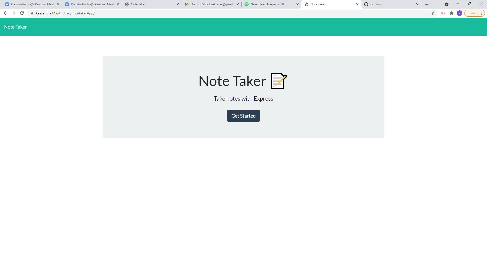

# Note Taker App

## Your Task

This application is a node express package based app that allows users to take notes, save and delete them in html interface with a backend express server.  It is deployed to Github and Heroku.

## Sample User Story

AS A small business owner
I WANT to be able to write and save notes
SO THAT I can organize my thoughts and keep track of tasks I need to complete

### Screenshot

### Github Repo

### Link to deployed App

https://kassandra14.github.io/noteTakerApp/

## 

  * Application must be deployed to Heroku.

